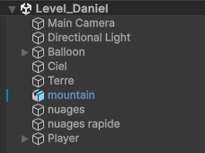
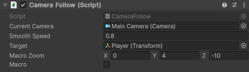
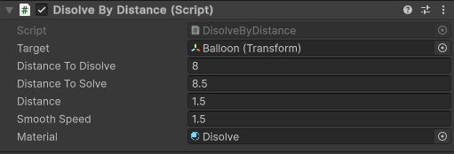
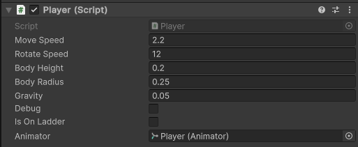
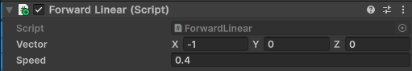

# Aide au développement

## Scène de test

J'ai travaillé dans la branche *design*. Il faudrait peut-être la fusionner avec la branche *main* comme ça tu peux bénéficier des adaptations.

Le fichier de scène s'appelle *Level_Daniel*.

### Structure de la hierarchie

Voici la hierarchie de la scène

### Camera

Dans le GameObject __Main Camera__ j'ai ajouté un script pour gérer le suivit de la camera sur l'utilisateur. Il se trouve dans le dossier Assets/_MainProject/Scripts/Camera.

Le paramètre Target pointe sur le personnage pour le suivre sur la scène. L'option __Macro__ permet de reculer la caméra ou de la remettre proche du joueur. Ce changement de possition est configuré avec le paramètre __Macro Zoom__.

J'ai ajouté un script pour cacher l'avant de l'engin si on a une certaine distance. Ce script s'appelle __DisolveByDistance__.

J'ai un shader que j'avais codé pour faire le disolve.

### Joueur

J'ai un début de script plour le déplacement du joueur. Ce script se nomme __Player__.

Il y a plusieurs paramètres qui permettent d'adapter le comportement du joueur.

La vitesse du déplacement du joueur se paramètre avec __Move Speed__.

La vitesse de rotation lors du changement de position c'est __Rotate Speed__.

__Body Height__ et __Body Radius__ est utilisé pour configuer les collider du personnage. L'option __Debug__ permet d'afficher ces éléments dans l'éditeur.

J'ai commencé à traiter les échelles mais cela ne fonctionne pas comme je voulais l'intégrer. 

### Nuages

Les nuages sont créés avec un générateur de particule. Cela rend le visuel assez simpa. à voir si utiliser une autre technique.

### Le fond

J'ai encore un script pour faire avancer la montagne dans le fond.

